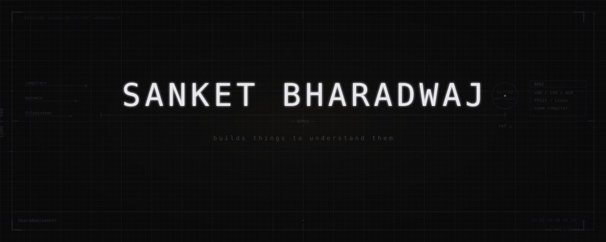

<picture>
  <source media="(prefers-color-scheme: dark)" srcset="assets/hero-dark.svg">
  <source media="(prefers-color-scheme: light)" srcset="assets/hero-light.svg">
  
</picture>

<div align="center">

<code>[22/tcp]</code> <a href="https://github.com/bharadwajsanket"><b>GitHub</b></a>
&nbsp;·&nbsp;
<code>[80/http]</code> <a href="https://sanketbharadwaj.vercel.app"><b>Portfolio</b></a>
&nbsp;·&nbsp;
<code>[443/tls]</code> <a href="mailto:sanketbharadwaj.dev@gmail.com"><b>Mail</b></a>

</div>

<div align="center">

```text
┌─────────────────────────────────────────────────────────────────────────┐
│                            CORE PHILOSOPHY                              │
├─────────────────────────────────────────────────────────────────────────┤
│  control        >  convenience                                         │
│  clarity        >  cleverness                                          │
│  correctness    >  shortcuts                                           │
│  implementation >  theory                                              │
└─────────────────────────────────────────────────────────────────────────┘
```

</div>

<br>

<table width="100%">
<tr>
<td valign="top" width="58%">

**// FIELD OBSERVATIONS & WORKSPACE STATUS**

There's a moment, usually late at night, when something stops working and no one knows why. Most people reach for Stack Overflow. I reach for the disassembler.

Not because it's faster — it rarely is. But because somewhere between the high-level source and the raw silicon there's a gap, and that gap has always felt like the most interesting place to be. That's where I spend most of my time.

</td>
<td valign="top" width="42%">

**// CODESPACE METRICS**

```text
[ACTIVE_CORES]   0x04
[PRIMARY_ARCH]   x86_64, ESP32, C99
[COMPILER_TGTS]  nasm, gcc, vyom_vm
[DEBUGGER_OPTS]  gdb -tui -q
[STATUS_REG]     ACTIVE_RUNNING_DEEP_METAL
```

</td>
</tr>
</table>

<br>

---

## VYOM — Language & Virtual Machine

**[Repo →](https://github.com/bharadwajsanket/vyom)**

A systems language built from first principles. Features a custom bytecode compiler, stack-based virtual machine, and dynamic execution frame stack. Designed to understand how syntax-level abstractions translate into physical machine instructions.

```text
// Compiler Input (*.vyom)               // Compiled Bytecode Target
fn main() {                              const_pool:
    let x = 42;                              [0] 42
    let y = 10;                              [1] 10
    let result = x * y;                  instructions:
    print(result);                           LOAD_CONST   0   ; push 42
}                                            STORE_FAST   0   ; pop -> x
                                             LOAD_CONST   1   ; push 10
                                             STORE_FAST   1   ; pop -> y
                                             LOAD_FAST    0   ; push x
                                             LOAD_FAST    1   ; push y
                                             MUL              ; x * y
                                             STORE_FAST   2   ; pop -> result
                                             LOAD_FAST    2   ; push result
                                             CALL_PRINT       ; print(result)
                                             RET              ; return
```

> Building a tree-walking interpreter is simple. Building a stack-based VM forces you to structure execution frames and address layouts explicitly. Every bytecode instruction is a design compromise between representation density and dispatcher latency.

---

## QRShare

**[Repo →](https://github.com/bharadwajsanket/qrshare)**

Sharing a file should not require an account, a third-party middleman, or remote servers. QRShare splits local files into visual matrix sequences, facilitating offline, serverless transfers directly from screen to camera.

```text
[ Data File ] ──(Huffman Enc)──> [ Base85 Bitstream ] ──(Fragment)──> [ Visual Matrix Sequence ]
                                                                              │
                                                                              │ (Optic Line of Sight)
                                                                              ▼
[ Target Reassembly ] <────────── [ Frame Reconstruction ] <────────── [ Optical Camera Capture ]
```

```text
Packet Header Format:
┌───────────────────┬───────────────────┬────────────────────┐
│  Magic (3 bytes)  │ Sequence (2 bytes)│  Payload (n bytes)  │
│  "QRS"            │ uint16            │  raw binary         │
└───────────────────┴───────────────────┴────────────────────┘
```

> Eliminating network infrastructure is the ultimate privacy vector. If there is no remote server, there is nothing to intercept. Only photons.

---

## Neotree

**[Repo →](https://github.com/bharadwajsanket/neotree)**

A C99 directory traversal utility. It recursively parses ignore files, applies ignore patterns, and structures output lists directly. Uses raw `dirent.h` and `stat()` POSIX calls with zero external dependencies.

```text
.
├── src/
│   ├── main.c
│   ├── tree.c
│   └── ignore.c
├── include/
│   └── neotree.h
└── .gitignore
```

```c
// Traversal algorithm core loop:
DIR *dir = opendir(path);
while ((entry = readdir(dir)) != NULL) {
    if (should_ignore(entry->d_name)) continue; // respect local ignore patterns

    struct stat st;
    char full_path[1024];
    snprintf(full_path, sizeof(full_path), "%s/%s", path, entry->d_name);
    stat(full_path, &st);              // retrieve file system node metrics

    print_node(entry->d_name, st.st_size); // formatted output
}
closedir(dir);
```

---

## Sanix

**[Repo →](https://github.com/bharadwajsanket/sanix)**

A bare-metal bootloader running in 16-bit x86 Real Mode. Compiled with NASM and booted from sector 0. Bypasses operating system loader constraints, loading directly to segment offset `0x7C00` to invoke BIOS screen interrupts and write characters directly to the VGA hardware text buffer page.

```text
Memory Layout Map:
┌──────────────────┐ 0xFFFF  ── BIOS ROM (Hardware interrupt service routines)
│     BIOS ROM     │
├──────────────────┤ 0xF000
│  VGA Text Buffer │         ── Direct write targets to video page RAM (0xB8000)
├──────────────────┤ 0xA000
│   Free low RAM   │
├──────────────────┤ 0x7E00
│  MBR Boot Sector │         ── Loaded by BIOS at segment boundary address
├──────────────────┤ 0x7C00  ◄── CS:IP starts execution loop here
│   System Stack   │         ── Statically allocated to grow downward
├──────────────────┤ 0x0500
│        IVT       │         ── Interrupt Vector Table offset registers
└──────────────────┘ 0x0000
```

```nasm
; Initial register configuration on boot entry:
cli                    ; Disable interrupts
xor ax, ax             ; Zero out register
mov ds, ax             ; Data Segment = 0x0000
mov es, ax             ; Extra Segment = 0x0000
mov ss, ax             ; Stack Segment = 0x0000
mov sp, 0x7C00         ; Stack pointer grows down from entry origin
sti                    ; Restore interrupts
```

---

## ION — Future Work & Experiments

**[Repo →](https://github.com/bharadwajsanket/ion)**

A content-addressed version control database model. Structures workspace changes directly to SHA-256 hashes, modeling code version changes as nodes within a Directed Acyclic Graph (DAG) without relying on staging file index buffers.

```text
Commit History DAG:
[ Commit A ] ──────> [ Commit B ] ──────> [ Commit C ] (Active HEAD)
 (hash: 4e9c...)       (hash: 8a3f...)      (hash: d2bc...)
```

> Version control is not a storage repository of files; it is a Directed Acyclic Graph of immutable content states. Tree objects match content hashes directly, making historical logs lightweight and self-describing.

---

## Workbench Specifications

<table width="100%">
<tr>
<td valign="top" width="33%">

**// SYSTEM HEADERS**

- `<sys/types.h>`
- `<sys/stat.h>`
- `<dirent.h>`
- `<unistd.h>`

</td>
<td valign="top" width="33%">

**// COMPILER OPTIONS**

- `-Wall -Wextra -O3`
- `-std=c99 -pedantic`
- `-fno-stack-protector`
- `-m32 -march=i386`

</td>
<td valign="top" width="33%">

**// LINKER COMMANDS**

- `ld -m elf_i386 -T link.ld`
- `nasm -f bin -o boot.bin`
- `objcopy -O binary`
- `gdb -symbols=boot.elf`

</td>
</tr>
</table>

---

## Discipline Field Notes (Bookshelf)

**[Vol_0x0A] Crafting Interpreters** — *Robert Nystrom*
The design of code execution machines is the design of constraints. Every bytecode instruction is a compromise between representation density, parsing latency, and virtual machine dispatcher overhead.

**[Vol_0x0B] OS: Three Easy Pieces** — *Arpaci-Dusseau*
Operating systems are the art of virtualization — tricking user application loops into believing they own absolute resources, while organizing memory paging registers, kernel tables, and raw I/O hardware context switches.

**[Vol_0x0C] Computer Systems: CS:APP** — *Bryant & O'Hallaron* — `queued`
**[Vol_0x0D] Designing Data-Intensive Applications** — *Martin Kleppmann* — `queued`

---

```text
--[ EOF ]------------------------------------------------------------------
[  306.912401] console: session connection closed by remote host.
[  306.912480] target: ds=0000 es=0000 ss=0000 sp=7c00 ip=7c00 cs=0000
[  306.912512] target state: execution halted.
```

